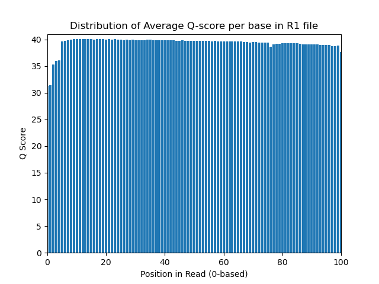
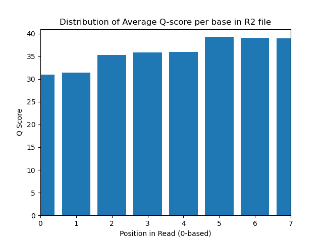
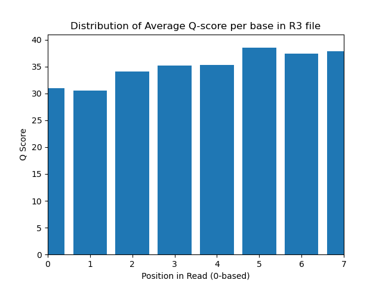
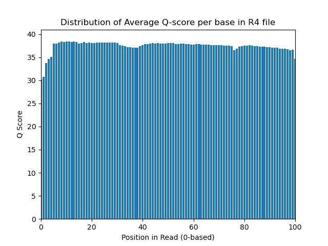

# Assignment the First

## Part 1
1. Be sure to upload your Python script. Provide a link to it here:
```
To find which files contain indexes/paired-end reads:
    zcat <file>  | head -4 

To take an informed guess at sequence lengths: 
    zcat <file> | sed -n '0~4p' | head -50000  | awk '{print length}' | uniq -c

To determine phred encoding (check if characters not in phred+64 exist):
    zcat <file> | sed -n '0~4p' | grep [0-9] | head
    
```

| File name | label | Read length | Phred encoding |
|---|---|---|---|
| 1294_S1_L008_R1_001.fastq.gz | read1 | 101 | Phred+33 |
| 1294_S1_L008_R2_001.fastq.gz | index1 | 8 | Phred+33 |
| 1294_S1_L008_R3_001.fastq.gz | index2 | 8 | Phred+33 |
| 1294_S1_L008_R4_001.fastq.gz | read2 | 101 | Phred+33 |

2. Per-base NT distribution
    1. Use markdown to insert your 4 histograms here.

    

    
    
    

    

    2. What is a good quality score cutoff for index reads and biological read pairs to utilize for sample identification and downstream analysis, respectively?
    ```
    33 for indexes, 35 for read pairs. This will leave us with mostly high-scoring sequences and thusly high confidence in downstream interpretations. 
    ```


    3. How many indexes have undetermined (N) base calls? (Utilize your command line tool knowledge. Submit the command(s) you used.
    ```
    zcat <file> | sed -n '2~4p' | grep -c "N" 

    R2: 3976613

    R3: 3328051

    Total: 7304664

    ```
    
## Part 2
1. Define the problem
2. Describe output
3. Upload your [4 input FASTQ files](../TEST-input_FASTQ) and your [>=6 expected output FASTQ files](../TEST-output_FASTQ).
4. Pseudocode
5. High level functions. For each function, be sure to include:
    1. Description/doc string
    2. Function headers (name and parameters)
    3. Test examples for individual functions
    4. Return statement
